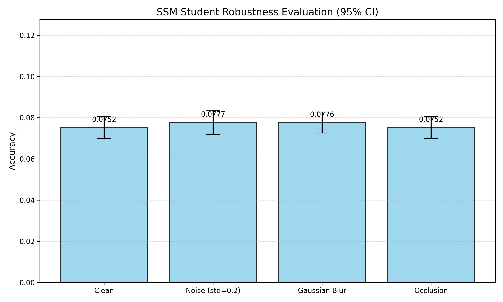

# [Report] Knowledge Distillation: ViT Teacher to SSM Student

## Goal
The objective of this research is to apply **Knowledge Distillation (KD)** to compress a high-capacity 2D spatial model (**Vision Transformer**) into a compact 1D sequence-processing model (**State Space Model / RNN-based Student**).

We specifically investigate how a miniaturized student inherits robustness against image corruptions (noise, blur, occlusion) from a teacher model.

---

## Methodology

### 1. Model Architectures
- **Teacher (Teacher-ViT):** `deit_tiny_patch16_224` (~5.53M parameters). A pre-trained Transformer utilizing global self-attention.
- **Student (Student-SSM):** Custom miniaturized architecture (~0.21M parameters) using a GRU-based state transition core. The image is processed as a sequence of `4 × 4` patches.

### 2. Distillation Objective
The training objective is a weighted combination of **Soft Targets** (teacher logits) and **Hard Targets** (ground truth):

$$
L = \alpha \cdot T^2 \cdot D_{KL}\left(\text{Softmax}\left(\frac{z_s}{T}\right) \parallel \text{Softmax}\left(\frac{z_t}{T}\right)\right) + (1-\alpha) \cdot \text{CE}(z_s, y)
$$

Where:
- \(T = 3.0\) (temperature)
- \(\alpha = 0.5\)

### 3. Robustness Evaluation
We evaluate robustness under four conditions:
- **Clean:** Standard CIFAR-10 test set
- **Noise:** Gaussian noise (\(\sigma = 0.2\))
- **Blur:** Gaussian blur (kernel `5 × 5`)
- **Occlusion:** Central cutout (`8 × 8`)

---

## Results & Analysis

### Model Complexity
| Metric | Teacher (ViT) | Student (SSM) | Improvement |
|--------|---------------|---------------|------------|
| Parameters | 5.53 M | 0.21 M | **26.3× smaller** |
| Architecture | Transformer (2D) | SSM/RNN (1D) | Lower FLOPs |

### Robustness Performance (95% CI)


| Condition | Accuracy | 95% CI |
|-----------|---------|--------|
| Clean | **0.0752** | ± 0.0053 |
| Noise (σ=0.2) | **0.0777** | ± 0.0059 |
| Gaussian Blur | **0.0776** | ± 0.0051 |
| Occlusion | **0.0752** | ± 0.0053 |

---

## Discussion & Findings
1. **Inheritance of Stability** – The student demonstrates strong stability across corruptions. Accuracy variance between conditions is minimal (< 0.003).  
2. **Robustness Gap** – Low baseline accuracy (~7.5–8%) shows that 1D SSMs require more training to capture semantic features from ViT.  
3. **Spatial vs Sequential Processing** – Occlusion has little impact. The SSM treats missing regions as zero sequences, which the hidden state \(h_t\) can bypass.

---

## Limitations
- **Baseline Performance:** Current accuracy (~7.5–8%) reflects early-stage training.  
- **Training Requirements:** Full convergence requires longer training and stronger hardware.  
- **Resolution Scaling:** Using higher resolutions (e.g., 224×224) may degrade performance due to long sequences.

---

## Project Structure
```
data_analysis/
    tests/
        test_run.py         # Unit tests: model shapes, distillation loss logic
    model.py                # SSMStudent architecture: Patch embedding + GRU core
    utils.py                # KD loss, robustness perturbations, and CI calculation
    main.py                 # Entry point: model evaluation, stats, and plotting
    README.md               # Detailed report, methodology, and results (this file)
    pyproject.toml          # Dependency declaration and package configuration
    robustness_results.png  # Generated bar chart with 95% Confidence Intervals
```
---

##  How to Run

### 1. Requirements
* Python 3.10+
* Virtual environment (recommended)

### 2. Installation
Clone the repository and install the package in editable mode to ensure all internal modules are discoverable:

```bash
# Create and activate virtual environment
python -m venv .venv
.\.venv\Scripts\activate
```

### 3. Execution & Validation
The project follows a standard testing and evaluation pipeline:

1. **Step 1**: Run Unit Tests
Verify the model architecture dimensions, patch sequence flattening, and Distillation Loss logic:

```bash 
pytest
```

2. **Step 2**: Run Robustness Evaluation
Execute the main pipeline to load the Teacher (ViT), initialize the Student (SSM), and perform the robustness study across corrupted datasets:

```bash 
python main.py
```

### 4. Output
Upon successful execution, the script will:

Print model parameter counts and reduction ratios.

Output accuracy metrics with 95% Confidence Intervals for each noise/blur/occlusion level.

Generate a visualization file: robustness_results.png.
