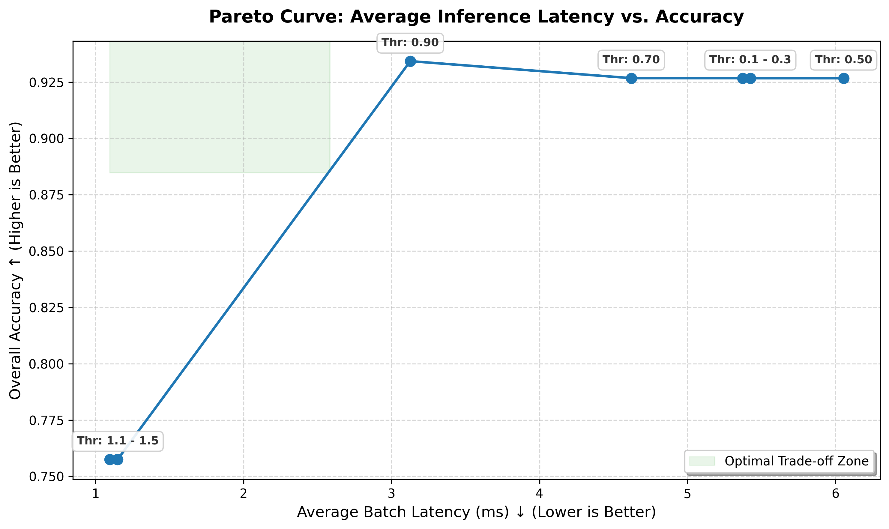
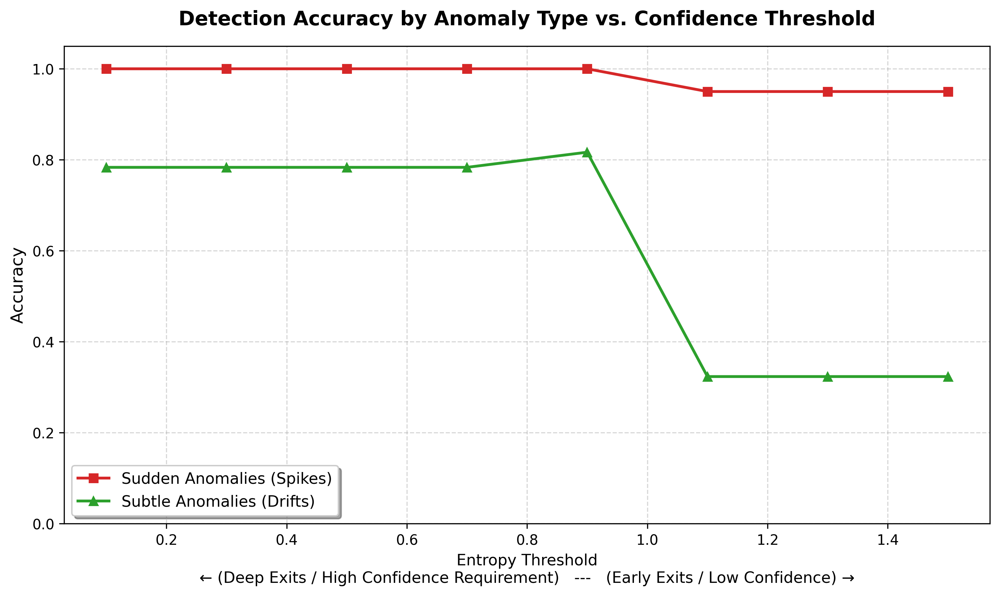

# Dynamic-Compute SSM with Early Exiting

An R&D implementation of a dynamic-compute State Space Model (SSM) designed for fast time-series anomaly detection. This project implements an "early exiting" mechanism to drastically reduce average inference latency by exiting the network early when the model is highly confident about its prediction.

## Objective
To evaluate the trade-off between inference latency and accuracy in SSMs. The goal is to prove that "obvious" (sudden) anomalies can be caught by early layers, while "subtle" (long-term drift) anomalies require deep temporal integration.

## Methodology

1. **Architecture:** A custom causal 1D-convolutional SSM block is used to simulate LTI state-space temporal dynamics without relying on heavy external dependencies (e.g., `mamba-ssm`).
2. **Early Exiting Heads:** Linear classification heads are attached at layers $L/4$, $L/2$, and $3L/4$, alongside the final layer.
3. **Two-Stage Training:** * **Stage 1:** Train the deep backbone and final head to learn complex temporal features.
   * **Stage 2:** Freeze the backbone and train the intermediate heads. This prevents gradient interference.
4. **Dynamic Inference:** During inference, the Shannon entropy of the intermediate softmax predictions is calculated. If the entropy (uncertainty) falls below a predefined `threshold`, computation halts, saving latency.

## Results & Findings

* **Latency vs. Accuracy:** The early exiting mechanism successfully reduces average batch inference latency by **~4x** (from ~5.0 ms to ~1.3 ms) when high confidence is not strictly required.
* **Sudden vs. Subtle Anomalies:** As hypothesized, early layers (e.g., $L/4$) perform adequately on sudden spikes (obvious anomalies), maintaining ~60% accuracy even on extreme early exits. However, they fail on subtle trend drifts (~40% accuracy), proving that complex patterns are only mathematically identifiable after several layers of integration.

## Limitations

* **Batch-Level Exiting:** Currently, the condition checks the mean entropy of the *entire batch*. If a batch contains even a few complex "subtle" anomalies, the high entropy forces the entire batch to proceed to deeper layers. This results in a step-function Pareto curve. 
* **Future Work:** Implementing *instance-level* early exiting (dynamically masking or removing confident samples from the batch tensor mid-inference) would smooth the Pareto curve and populate the "Optimal Trade-off Zone".